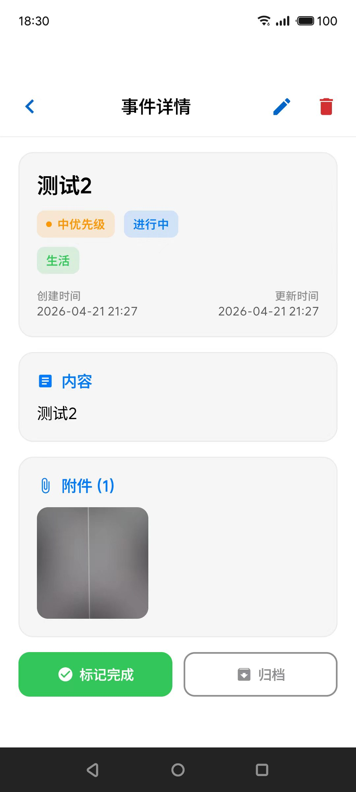
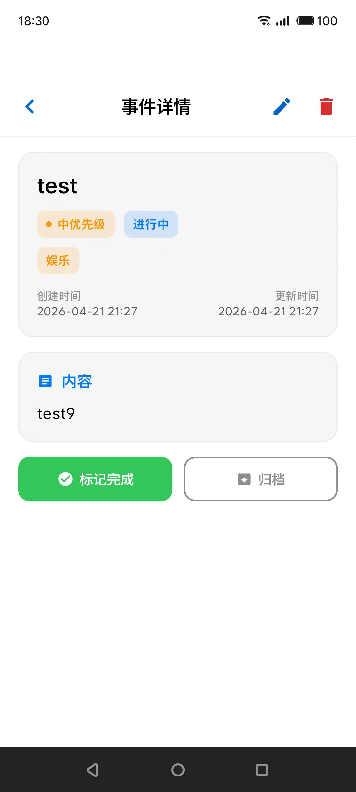
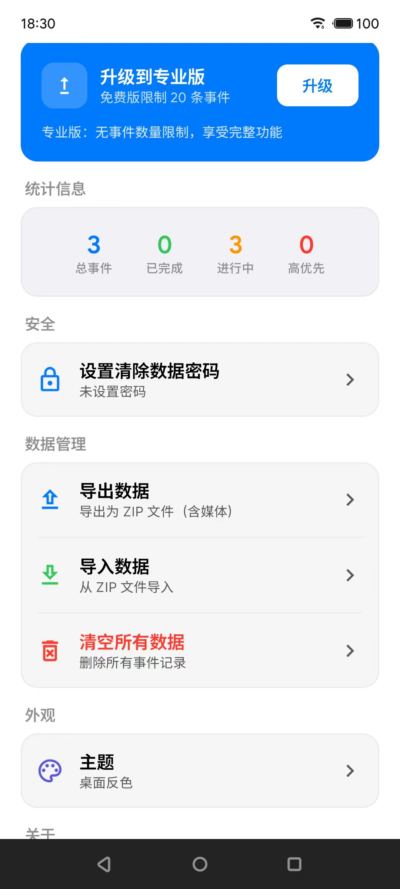
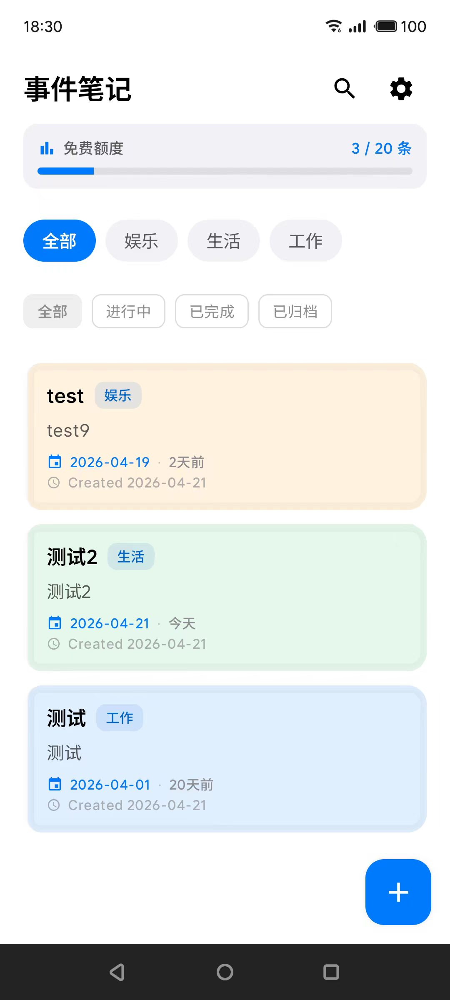

# EventNote - 事件管理应用

一个现代化的 Android 事件管理应用，使用 Jetpack Compose 和 MVVM 架构开发。🚀

## 📸 应用预览

### 🎨 分类颜色区分效果

| 工作分类 | 学习分类 |
|---------|---------|
|  |  |

| 生活分类 | 娱乐分类 |
|---------|---------|
|  |  |

### 🌟 主要界面展示
- **事件列表**: 清晰的分类颜色区分和智能时间显示
- **事件详情**: 完整的事件信息展示
- **创建编辑**: 直观的事件管理界面
- **设置页面**: 个性化配置选项

## �� 功能特性

### 核心功能
- ✅ **事件管理**: 创建、编辑、删除事件
- ✅ **多媒体支持**: 图片、视频、录音附件
- ✅ **智能提醒**: 通知、闹钟、静音提醒
- ✅ **分类管理**: 事件分类和标签系统
- ✅ **搜索筛选**: 按状态、优先级、日期筛选
- ✅ **数据统计**: 事件统计和分析

### 高级特性
- 🎨 **分类颜色区分**: 不同分类的事件卡片具有不同的颜色
- 📅 **智能时间显示**: 事件时间优先，支持相对天数计算
- 🌙 **深色模式**: 完整的主题切换支持
- 📱 **响应式设计**: 适配不同屏幕尺寸
- 🔐 **权限管理**: 相机、录音、存储等权限
- 🚀 **开机自启**: 设备重启后自动启动提醒服务

## 🏗️ 技术架构

### 核心技术栈
- **开发语言**: Kotlin
- **UI 框架**: Jetpack Compose
- **架构模式**: MVVM (Model-View-ViewModel)
- **数据库**: Room (SQLite)
- **依赖注入**: Hilt
- **导航**: Navigation Compose
- **构建工具**: Gradle 8.7

### 主要依赖库
```kotlin
// Jetpack Compose
implementation("androidx.compose.ui:ui")
implementation("androidx.compose.material3:material3")

// Room 数据库
implementation("androidx.room:room-runtime")
implementation("androidx.room:room-ktx")

// Hilt 依赖注入
implementation("com.google.dagger:hilt-android")

// Navigation Compose
implementation("androidx.navigation:navigation-compose")

// 其他依赖
implementation("io.coil-kt:coil-compose") // 图片加载
```

## 📁 项目结构

```
EventNote/
├── app/src/main/java/com/example/eventnote/
│   ├── data/                    # 数据层
│   │   ├── local/              # Room 数据库
│   │   │   ├── entity/         # 数据实体
│   │   │   └── dao/            # 数据访问对象
│   │   └── repository/         # 数据仓库
│   ├── screens/                # UI 页面
│   │   ├── ListScreen.kt       # 事件列表
│   │   ├── EventDetailScreen.kt # 事件详情
│   │   ├── CreateEditScreen.kt  # 创建/编辑
│   │   └── SettingsScreen.kt    # 设置页面
│   ├── navigation/             # 导航配置
│   ├── ui/                     # UI 组件和主题
│   ├── di/                     # 依赖注入配置
│   └── util/                   # 工具类
├── build.gradle.kts            # 构建配置
├── settings.gradle.kts         # 项目设置
└── gradle.properties           # Gradle 属性
```

## 🚀 快速开始

### 环境要求
- Android Studio Flamingo 或更高版本
- Java JDK 17+
- Gradle 8.0+
- Android SDK API 24+

### 构建步骤
1. **克隆项目**
   ```bash
   git clone <repository-url>
   cd EventNote
   ```

2. **构建 APK**
   ```bash
   # 调试版
   ./gradlew assembleFreeDebug
   
   # 发布版
   ./gradlew assembleFreeRelease
   ```

3. **安装运行**
   ```bash
   adb install app/build/outputs/apk/free/debug/app-free-debug.apk
   ```

## 🎨 设计特色

### 分类颜色系统
- **工作** → 蓝色 (#007AFF)
- **学习** → 紫色 (#5856D6)
- **生活** → 绿色 (#34C759)
- **娱乐** → 橙色 (#FF9500)
- **健康** → 红色 (#FF2D55)
- **财务** → 深紫色 (#AF52DE)

### 视觉设计
- Material Design 3 设计语言
- Apple 风格的卡片设计
- 流畅的动画和过渡效果
- 智能的颜色区分系统

## 📱 应用变体

### 免费版
- **包名**: `com.example.eventnote`
- **限制**: 最多 20 个事件
- **版本**: 1.0.0

### 专业版
- **包名**: `com.example.eventnote.pro`
- **限制**: 无限制
- **版本**: 1.0.0-pro

## 🔄 版本历史

### v1.0.0 (当前版本)
- ✅ 完整的事件管理功能
- ✅ 多媒体附件支持
- ✅ 智能提醒系统
- ✅ 分类颜色区分
- ✅ 优化时间显示逻辑
- ✅ Material Design 3 界面

## 📄 许可证

本项目采用**双重许可证模式**：

### 🏠 个人使用 (免费)
- ✅ 个人项目、学习、研究
- ✅ 非营利性用途
- ✅ 无需联系，直接使用
- ❌ 不得用于商业目的

### 💼 商业使用 (付费授权)
- ✅ 商业产品集成
- ✅ 营利性服务
- ✅ 技术支持和维护
- 📧 需要商业授权: [your-email@example.com]

详细信息请查看 [LICENSE](LICENSE) 文件。

## 🤝 贡献

欢迎提交 Issue 和 Pull Request！

1. Fork 本项目
2. 创建特性分支 (`git checkout -b feature/AmazingFeature`)
3. 提交更改 (`git commit -m 'Add some AmazingFeature'`)
4. 推送到分支 (`git push origin feature/AmazingFeature`)
5. 开启 Pull Request

## 📞 联系方式

如有问题或建议，请通过以下方式联系：

- 📧 Email: [your-email@example.com]
- 🐛 Issues: [GitHub Issues](https://github.com/your-username/EventNote/issues)

---

⭐ 如果这个项目对您有帮助，请给它一个星标！
